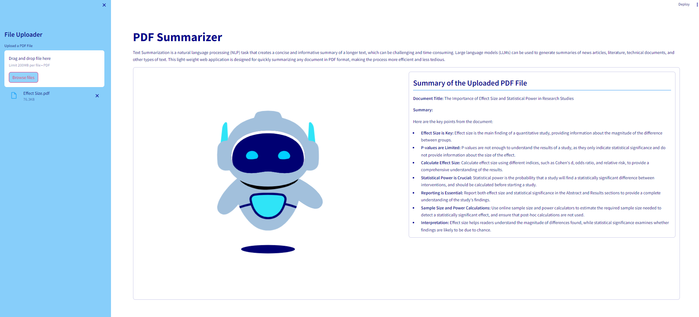

## PDF Summarizer

### Background
Text Summarization is a natural language processing (NLP) task that creates a concise and informative summary of a longer text, which can be challenging and time-consuming. Large language models (LLMs) can generate summaries of news articles, literature, technical documents, and other types of text. This lightweight web application is designed to quickly summarize any document in PDF format using an open-source LLM, making the process more efficient and less tedious.  

<a href=" ">Web Application</a>
